# WeChat EXP 使用手册

> 版本：2.1 | 更新日期：2026-05-31 | 适用 WeChat 4.x（已测试 4.1.9 / 4.1.10）| Windows 10/11

---

## ⚠️ 重要警告 — 请务必阅读

**本工具仅供个人学习、研究和技术交流使用。使用者必须遵守以下规定：**

1. **仅限个人数据**：您只能备份、查看和分析**您自己的**微信聊天记录。未经他人明确同意，**严禁**获取、查看、分析他人的微信数据。
2. **禁止非法用途**：严禁将本工具用于任何侵犯他人隐私、窃取商业秘密、进行网络监控等违法违规活动。
3. **自行承担责任**：使用者对自身行为负全部法律责任。本工具的开发者不对任何滥用行为承担责任。
4. **遵守法律法规**：请遵守您所在地区的法律法规。在中国境内，未经授权的个人信息收集和处理违反《个人信息保护法》。
5. **数据安全**：本工具在本地运行，不会将您的任何数据上传到互联网。但解密后的数据存储在您的电脑上，请妥善保管。

> **如果您不同意上述条款，请立即删除本工具及其所有相关文件。**

---

## 目录

1. [快速开始（只需 2 步）](#1-快速开始只需-2-步)
2. [系统要求](#2-系统要求)
3. [Web 界面功能详解](#3-web-界面功能详解)
   - [3.1 仪表盘首页](#31-仪表盘首页)
   - [3.2 数据采集 — 一键备份](#32-数据采集--一键备份)
   - [3.3 浏览与分析 — 聊天查看器](#33-浏览与分析--聊天查看器)
   - [3.4 浏览与分析 — 年度报告](#34-浏览与分析--年度报告)
   - [3.5 浏览与分析 — 词云分析](#35-浏览与分析--词云分析)
   - [3.6 导出 — 聊天记录导出](#36-导出--聊天记录导出)
   - [3.7 导出 — 综合报告](#37-导出--综合报告)
   - [3.8 导出 — 员工报表](#38-导出--员工报表)
   - [3.9 工具 — 垃圾清理、密钥提取与解密数据库](#39-工具--垃圾清理密钥提取与解密数据库)
4. [聊天查看器使用详解](#4-聊天查看器使用详解)
   - [4.1 界面布局](#41-界面布局)
   - [4.2 搜索联系人](#42-搜索联系人)
   - [4.3 消息筛选](#43-消息筛选)
   - [4.4 消息类型展示](#44-消息类型展示)
   - [4.5 语音转文字](#45-语音转文字)
   - [4.6 群组信息查看](#46-群组信息查看)
5. [V2 图片显示问题](#5-v2-图片显示问题)
6. [常见问题 (FAQ)](#6-常见问题-faq)
7. [附录：命令行参考（高级用户）](#7-附录命令行参考高级用户)

---

## 1. 快速开始（只需 2 步）

WeChat EXP 是一款 Windows 平台下的微信聊天记录**备份、查看与分析**工具。下载后双击即可使用，无需安装 Python 环境。

**主要功能一览：**

| 功能 | 说明 | 在哪里操作 |
|------|------|-----------|
| 一键备份 | 自动备份微信聊天记录（含图片、视频、文件、语音） | Web 仪表盘 → 数据采集 |
| 聊天查看 | 像微信一样浏览聊天记录，支持搜索、筛选 | Web 仪表盘 → 聊天查看器 |
| 图片查看 | 查看微信中的图片（含 V2 新版加密图片） | 聊天查看器中自动显示 |
| 导出聊天 | 将聊天记录导出为 TXT/HTML 文件 | Web 仪表盘 → 聊天导出 |
| 词云分析 | 生成聊天高频词汇的视觉化词云 | Web 仪表盘 → 词云分析 |
| 综合报告 | 生成包含统计图表的 HTML 分析报告 | Web 仪表盘 → 综合报告 |
| 年度报告 | Spotify-Wrapped 风格的个人年度聊天总结 | Web 仪表盘 → 年度报告 |

**只需两步，即可开始使用：**

```
第一步：登录微信（建议刚登录后立即操作）
第二步：双击 wechat_exp.exe 启动程序 → 点击"一键备份"
```

启动后，程序会自动在浏览器中打开 Web 操作界面（地址为 `http://127.0.0.1:5000`）。如果没有自动打开，请手动打开浏览器并访问该地址。

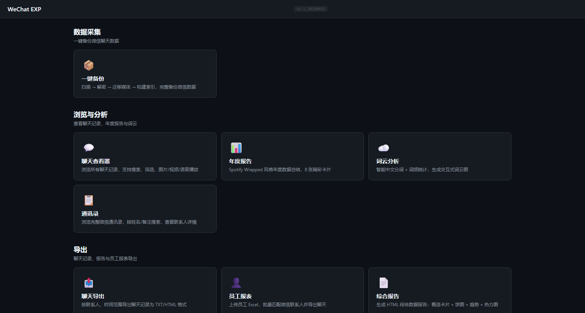
*图 1：程序启动后自动打开的 Web 仪表盘首页*

> **提示**：首次使用时，微信必须正在运行且已登录，程序才能自动提取密钥并完成备份。之后的日常使用无需微信运行。
>
> ⚠️ **关键**：微信登录后，各数据库密钥仅在**登录初期一小段时间内**全部驻留在内存中。时间越久，微信越可能将久未访问的老数据库密钥从内存中清除。**建议在微信登录后尽快运行备份**，以确保所有数据库密钥都能被成功提取。

---

## 2. 系统要求

| 要求 | 说明 |
|------|------|
| 操作系统 | Windows 10 / Windows 11（64 位） |
| 微信版本 | WeChat 4.x（已测试 4.1.9 / 4.1.10，其他版本未经测试） |
| 磁盘空间 | 需要与微信数据目录大小相近的可用空间（通常 2-10 GB） |
| 其他 | 首次备份需要微信正在运行并已登录，且**建议在刚登录后立即运行**（密钥窗口期有限） |

> **注意**：本程序为独立可执行文件（.exe），**不需要**安装 Python 或其他运行环境。下载后直接双击即可使用。

---

## 3. Web 界面功能详解

启动程序后，所有操作都在 Web 网页中进行。以下按 Web 界面的四个功能模块逐一说明。

### 3.1 仪表盘首页

打开程序后看到的第一个页面就是仪表盘首页。页面分为**四个功能模块**：

| 模块 | 位置 | 包含的功能按钮 |
|------|------|--------------|
| **数据采集** | 左上方 | 「一键备份」 |
| **浏览与分析** | 右上方 | 「聊天查看器」「年度报告」「词云分析」「通讯录」 |
| **导出** | 左下方 | 「聊天导出」「员工报表」「综合报告」 |
| **工具** | 右下方 | 「垃圾清理」「提取密钥」「解密数据库」 |

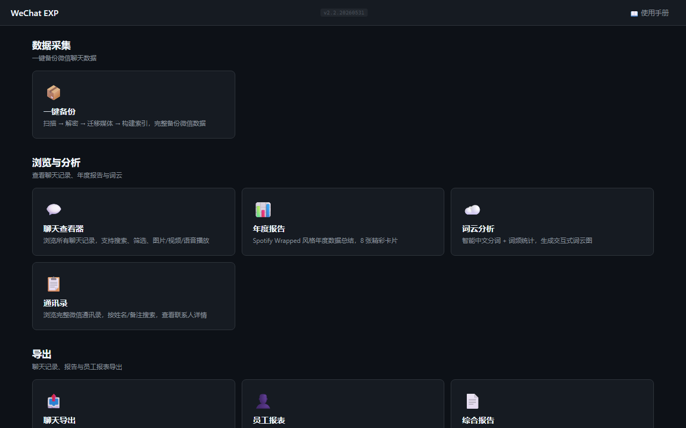
*图 2：仪表盘首页 — 四个功能模块*

每个模块包含一个或多个**按钮**，点击按钮即可进入对应的功能页面。下面按模块逐一介绍。

---

### 3.2 数据采集 — 一键备份

这是您首次使用时的**第一步操作**。

**操作步骤：**

1. **重新登录微信**（建议：退出微信 → 重新登录，确保所有数据库密钥都在内存中）
2. 在仪表盘首页，找到「**数据采集**」模块
3. 点击「**一键备份**」按钮
4. 进入备份页面后，可以选择备份的日期范围（默认最近 30 天）
5. 点击「**开始备份**」按钮
6. 页面底部会出现进度条，实时显示备份进度
7. 等待四个阶段依次完成：扫描账号 → 解密数据库 → 迁移媒体 → 构建索引

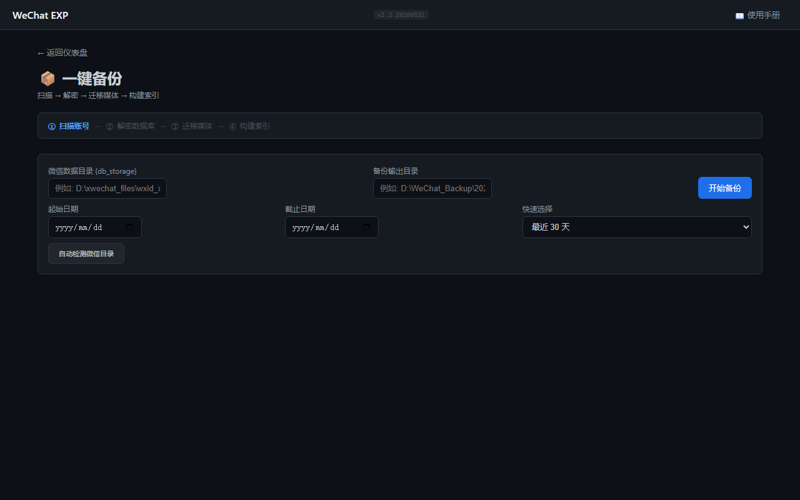
*图 3：Web 备份页面 — 设置日期范围后点击"开始备份"*

**备份过程分四个阶段：**

| 阶段 | 显示文字 | 说明 | 大约耗时 |
|------|---------|------|---------|
| ① 扫描 | "正在扫描账号..." | 自动查找微信数据目录 | 几秒 |
| ② 解密 | "正在解密数据库..." | 解密微信加密的数据库文件，**缺密钥时自动从微信进程提取** | 10-60 秒 |
| ③ 迁移 | "正在迁移媒体文件..." | 复制图片、视频、语音、文件 | 1-5 分钟 |
| ④ 索引 | "正在构建索引..." | 建立聊天记录统一索引，**支持跨分片数据聚合** | 10-30 秒 |

> ⚠️ **重要提示**：
> - 整个备份过程通常需要 2-5 分钟，具体时间取决于微信数据量的大小。
> - 如果部分数据库缺少密钥，程序会自动从微信进程内存中提取并重试（需微信正在运行）。
> - **微信登录后越久，老数据库的密钥越可能已从内存中清除。** 如果自动提取失败，**退出微信 → 重新登录 → 立即运行备份**，通常即可解决。

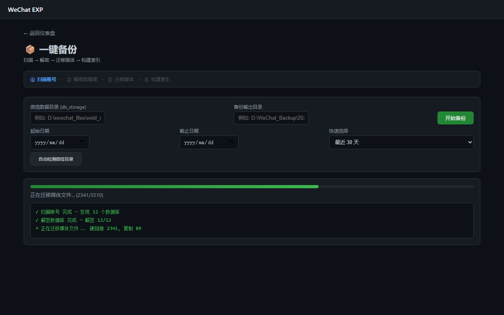
*图 4：备份进行中 — 实时进度条和日志输出*

**备份完成后**，页面会显示"操作完成"。此时您可以：
- 点击「返回仪表盘」→ 进入「聊天查看器」浏览聊天记录
- 或直接使用其他功能

**备份结果保存在**：`wechat_exp.exe` 所在目录下的 `backup\` 文件夹中。

> **日常使用提示**：首次备份后，如果只是查看聊天记录，不需要再次备份。只有当微信中有新的聊天记录需要更新时，再运行备份即可。

---

### 3.3 浏览与分析 — 聊天查看器

点击仪表盘中的「**聊天查看器**」按钮，进入聊天浏览界面。

**界面左侧**是联系人列表，显示所有聊天对象（联系人、群聊），按最新消息时间排序。

**界面右侧**是消息显示区域，点击左侧任意联系人或群聊，即可查看对应的聊天记录。


*图 5：聊天查看器 — 左侧联系人列表，右侧消息区域*

**头像系统（三级加载）：**
1. 从微信 CDN 代理加载真实头像，成功后缓存到 `output/avatar_cache/`
2. 群聊生成 2×2 成员首字符组合头像
3. CDN 不可达时生成 SVG 默认头像：基于 MD5 确定性的渐变色 + 首字符

**名称解析（五级策略）：**
- **个人联系人**：备注 > 昵称 > 别名 > 微信号，智能跳过与微信号相同的无效字段
- **群聊名称**：contact.db 备注/昵称 → session.db 摘要 → 群成员昵称拼接 → 群主信息 → 降级方案

聊天查看器的详细操作指南见[第 4 章](#4-聊天查看器使用详解)。

---

### 3.4 浏览与分析 — 年度报告

点击仪表盘中的「**年度报告**」按钮，自动生成一份精美的年度聊天数据报告。

报告包含 7 张卡片：
- 全局概览（消息总数、活跃天数等）
- 作息时间表（24小时 × 7天 热力图）
- 消息字数统计
- 回复速度分析
- 表情使用排行（表情宇宙）
- 月度挚友榜
- 关键词词云

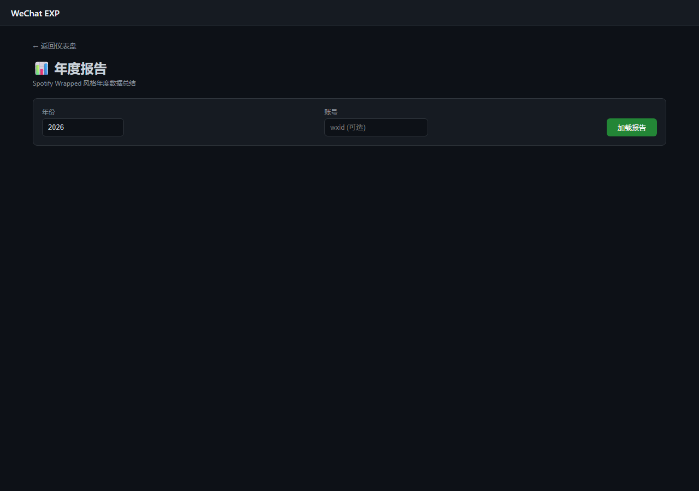
*图 6：年度报告 — 数据卡片展示*

---

### 3.5 浏览与分析 — 词云分析

点击仪表盘中的「**词云分析**」按钮，进入词云生成页面。

**操作步骤：**

1. 在「**聊天对象**」输入框中，输入联系人或群聊的名称（支持模糊输入，如输入"张"）
2. 点击「**开始分析**」按钮
3. 如果匹配到多个结果，系统会弹出选择列表，点击想要分析的对象
4. 系统开始提取文本、分析词频
5. 完成后点击链接，在新标签页中查看交互式词云

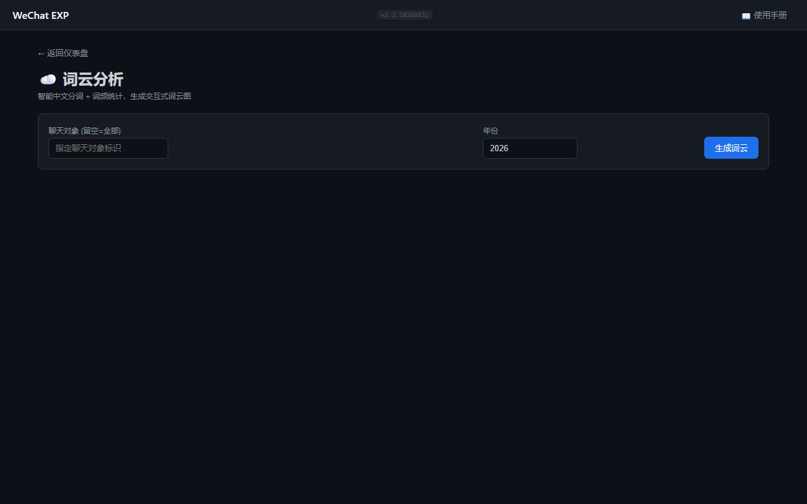
*图 7：词云分析 — 智能匹配后生成的可交互词云*

---

### 3.6 导出 — 聊天记录导出

点击仪表盘中的「**聊天导出**」按钮，进入导出页面。

**操作步骤：**

1. 在「**联系人/群聊标识**」输入框中，输入联系人或群聊的名称
   - 支持模糊输入，只输入部分名称即可（如输入"中望"）
2. （可选）选择「**开始日期**」和「**结束日期**」，限定导出范围
3. （可选）选择导出格式：「TXT 文本」或「HTML」
4. 点击「**开始导出**」按钮
5. 系统自动扫描匹配：
   - **只有 1 个匹配**：直接开始导出
   - **多个匹配**：弹出选择列表，显示每个对象的名称和消息数量，**点击选择**后再导出
   - **无匹配**：显示"未找到联系人"
6. 导出完成后，点击「📥 下载导出文件」按钮，保存到本地

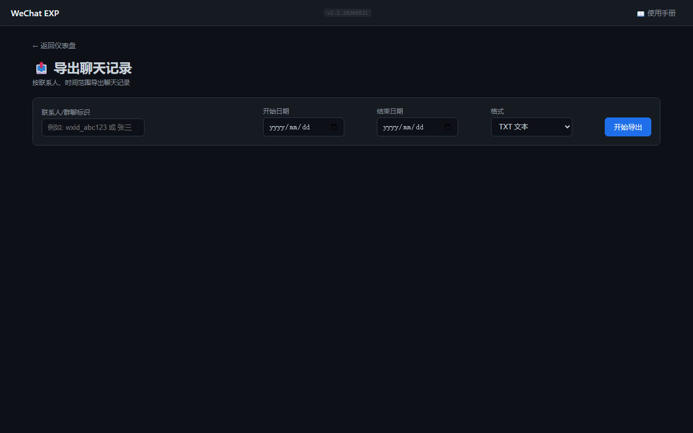
*图 8：聊天导出页面 — 输入名称后可选择日期和格式*

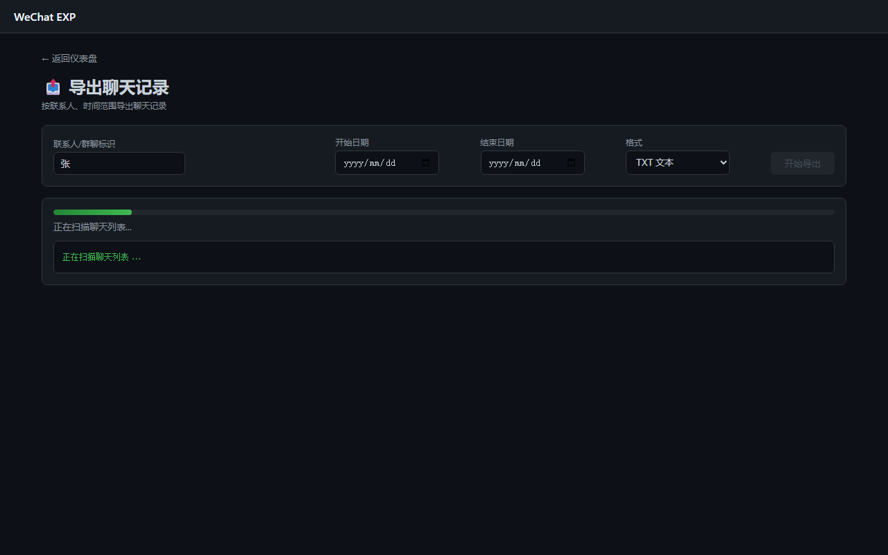
*图 9：智能匹配选择列表 — 多个匹配时弹出供用户选择*

---

### 3.7 导出 — 综合报告

点击仪表盘中的「**综合报告**」按钮，自动生成包含统计图表的 HTML 分析报告。

报告内容涵盖：
- 消息总量趋势（按月统计的柱状图）
- 消息类型分布（饼图：文本、图片、视频、语音等占比）
- 最活跃时段（一天 24 小时的分布柱状图）
- 最活跃星期（一周 7 天的分布）
- 联系人消息排名
- 媒体文件统计

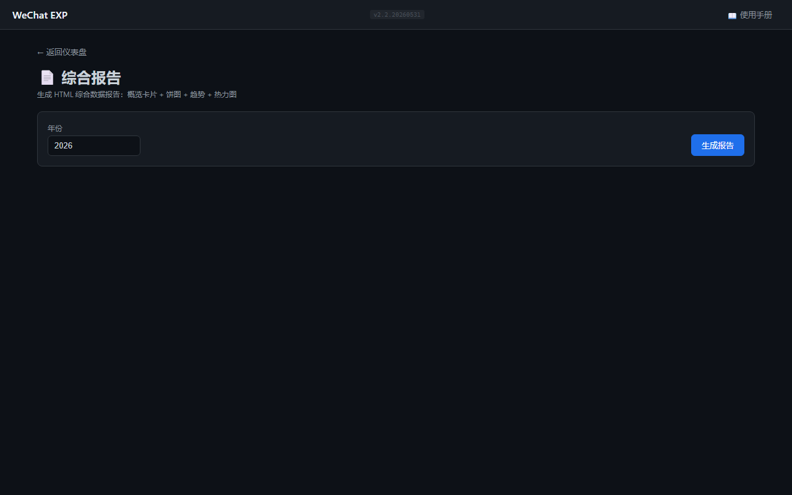
*图 10：综合报告 — 包含 ECharts 交互式图表*

**图表标注说明：**

报告中所有饼图和柱状图**默认显示数据标签**（类别名、百分比、具体数值），无需鼠标悬停即可查看完整信息。

页面右上角有「**隐藏数据标签**」按钮，点击后所有图表标注消失，再次点击恢复显示。您可以根据需要切换。

---

### 3.8 导出 — 员工报表

点击仪表盘中的「**员工报表**」按钮，进入员工报表生成页面。

此功能用于**批量导出**：上传一份包含员工姓名或微信号的 Excel 表格，系统会自动匹配微信联系人并批量导出每个人的聊天记录。

**操作步骤：**

1. 准备一份 Excel 文件（.xlsx），包含员工姓名或微信号列
2. 点击「**选择文件**」上传 Excel
3. 点击「**开始导出**」
4. 系统自动匹配并批量导出，完成后显示结果

---

### 3.9 工具 — 垃圾清理、密钥提取与解密数据库

这三个功能位于仪表盘底部的「**工具**」模块，用于维护和特殊情况处理。

**垃圾清理：**

用于释放微信占用的磁盘空间。点击进入后，程序会扫描各聊天的空间占用情况，按**空间从大到小排序**，清晰展示每个聊天的图片、视频、文件占用。

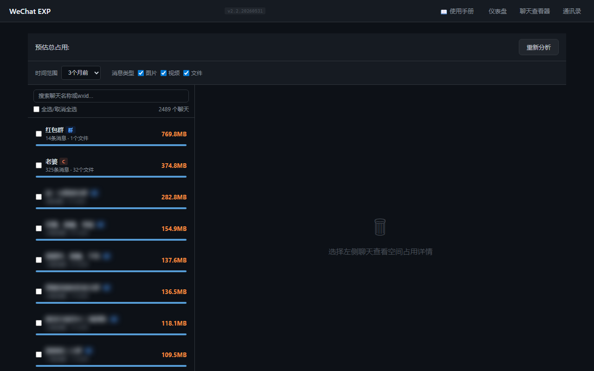
*图 16：垃圾清理主界面 — 按空间占用排序的聊天列表，彩色条形图直观展示图片/视频/文件占比*

点击任意聊天可查看**空间占用详情**：

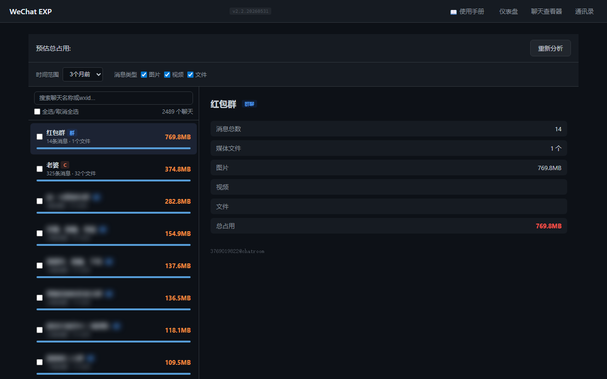
*图 17：点击聊天查看空间占用详情 — 消息总数、各类型媒体文件数量和字节数*

在左侧列表中勾选需要清理的聊天，底部会出现"预览删除"按钮。点击后会展示将要删除的文件数量和释放空间，确认后执行删除。

> 清理操作仅删除媒体文件（图片/视频/文件），聊天文字记录保留在数据库中不受影响。
> 清理操作**不可逆**，请在清理前确认备份已完成。

**提取密钥：**

当备份时提示"密钥不足"无法解密数据库时使用。点击该按钮后，程序从微信进程内存中提取数据库密钥并保存。

> ⚠️ **密钥存在的窗口期很短！** 微信在刚登录时，会加载所有数据库的密钥到内存中（因为它要检查各联系人的未读消息等）。但随着时间推移，微信可能将很久没访问过的老数据库的密钥从内存中释放掉——这是微信自身的内存管理行为，无法通过程序控制。
>
> **最佳实践：退出微信 → 重新登录 → 立即点击「提取密钥」或运行「一键备份」。** 这是获取全量密钥的最可靠方式。
>
> 此操作需要微信正在运行。程序支持 WeChat.exe 和 Weixin.exe（微信不同版本的进程名）。

**解密数据库：**

如果您已有备份的原始数据库文件但尚未解密，可以使用此功能单独解密。

---

## 4. 聊天查看器使用详解

聊天查看器是本工具最核心的功能，以下逐一介绍界面的各个部分和操作方法。

### 4.1 界面布局

进入聊天查看器后，界面分为三个区域：

| 区域 | 位置 | 内容 |
|------|------|------|
| **联系人列表** | 左侧 | 所有联系人/群聊，含头像和最新消息预览 |
| **消息区域** | 中间偏右 | 当前选中聊天的消息记录 |
| **搜索/筛选栏** | 顶部 | 联系人搜索框和消息筛选按钮 |


*图 11：聊天查看器界面布局 — 三个功能区域*

---

### 4.2 搜索联系人

在顶部**搜索框**中输入姓名、备注名或微信号，联系人列表会自动过滤，只显示匹配的结果。

**操作技巧：**
- 输入单个汉字（如"张"）即可过滤所有姓张的联系人
- 支持拼音模糊匹配
- 清除搜索框内容即可恢复完整列表
- 群聊名称同样支持搜索

---

### 4.3 消息筛选

点击消息区域顶部的「**筛选**」按钮，展开筛选面板。您可以通过以下条件精确定位消息：

| 筛选项 | 说明 | 示例 |
|--------|------|------|
| **日期范围** | 选择起始和结束日期 | 只看 2026 年 5 月的消息 |
| **消息类型** | 按类型筛选 | 只看图片，或只看文件 |
| **发送者** | 群聊中按发送者筛选 | 只看某个人发的消息 |
| **关键词** | 全文搜索 | 搜索包含"会议"的消息 |

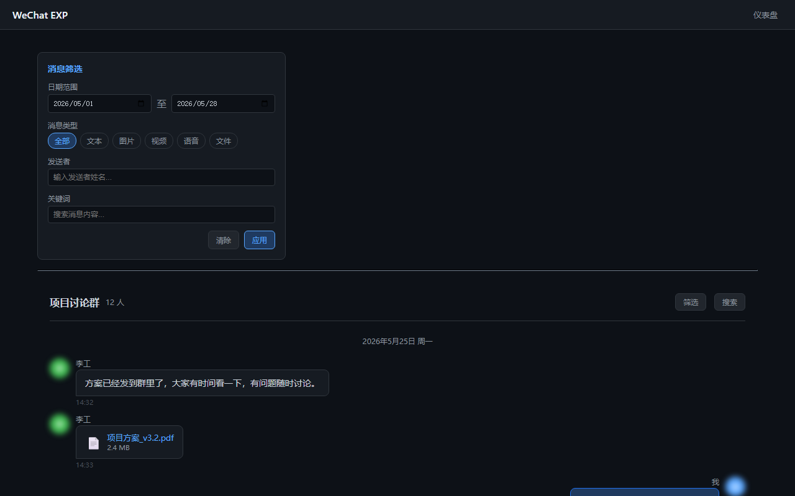
*图 12：消息筛选面板 — 多维度组合筛选*

设置好筛选条件后点击「**应用**」，消息区域只显示符合条件的结果。点击「**清除**」可恢复显示全部消息。

---

### 4.4 消息类型展示

聊天查看器支持所有微信消息类型的展示：

| 消息类型 | 界面显示 | 操作方式 |
|---------|---------|---------|
| **文字消息** | 气泡样式，支持 emoji 表情 | 直接阅读 |
| **图片** | 缩略图显示 | **点击缩略图**可放大查看原图 |
| **视频** | 视频播放器 | 点击播放按钮观看 |
| **语音** | 播放条 + 时长 | 点击播放按钮收听 |
| **文件** | 文件名 + 大小 | 点击下载文件 |
| **表情/贴纸** | 表情图片 | 直接查看 |
| **引用回复** | 引用卡片 | 显示被引用的原始消息 |
| **小程序卡片** | 图标 + 渐变背景 + 名称 | 显示小程序信息 |
| **视频号卡片** | 图标 + 缩略图 + 名称 | 显示视频号信息 |
| **系统消息** | 灰色居中文字 | 如"XXX 加入了群聊" |

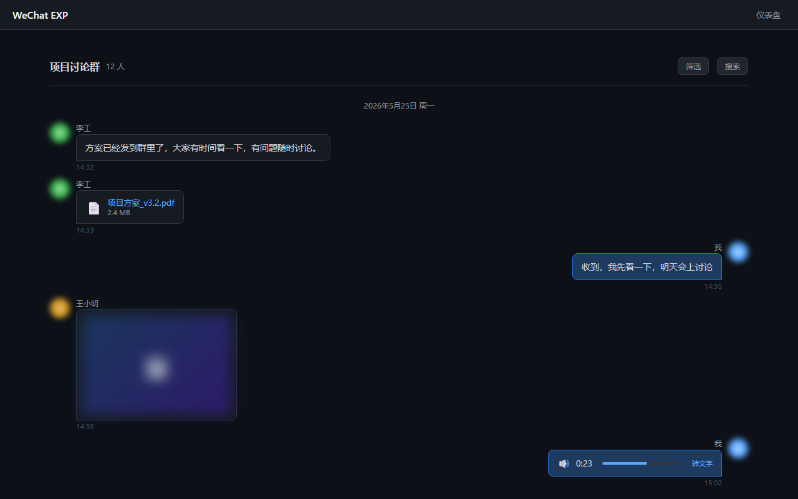
*图 13：各类消息在查看器中的展示效果*

---

### 4.5 语音转文字

语音消息右侧有一个「**转文字**」按钮。

点击该按钮后，系统使用 Whisper AI 模型将语音内容转为文字显示。首次使用时会自动下载模型文件（约 140MB），之后的转换在本地离线完成。

**操作步骤：**
1. 找到语音消息（显示播放条的消息）
2. 点击消息右侧的「**转文字**」按钮
3. 等待几秒钟，转换结果会显示在语音消息下方

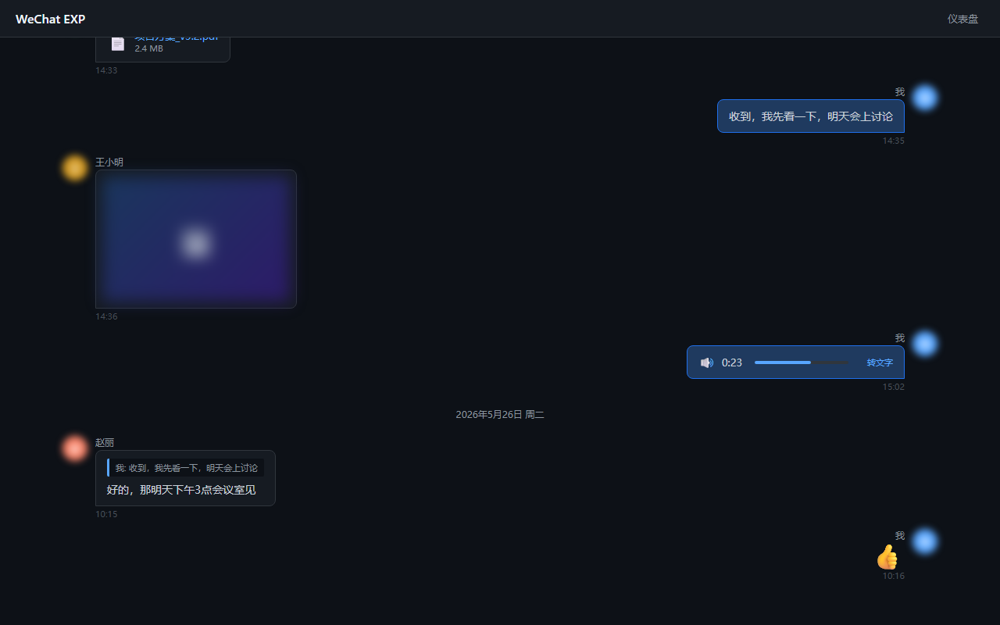
*图 14：语音转文字功能 — 点击按钮后显示识别结果*

---

### 4.6 群组信息查看

在群聊中，点击聊天窗口顶部的**群名**，可以展开群组信息面板。

面板显示：
- 群成员列表（含头像和显示名称）
- 群主标识
- 成员数量

---

## 5. V2 图片显示问题

### 5.1 什么是 V2 图片

微信 4.x 版本使用了新的图片加密方式（称为"V2 加密"）。每张加密图片有一个**唯一的密钥**，这个密钥只存在于微信程序运行时内存中，不会保存到硬盘。

### 5.2 为什么有些图片无法显示

当您在聊天查看器中看到提示"**V2加密图片，暂不支持解码**"时，说明该图片的密钥尚未被程序获取到。

### 5.3 如何让图片正常显示

**解决方法：**

1. 启动微信并登录
2. 在微信中**找到包含这些图片的聊天记录**
3. **滚动浏览这些聊天**（让图片出现在微信界面上）
4. 点击仪表盘「**工具**」模块中的「**提取密钥**」
5. 程序会自动扫描微信内存，获取已加载图片的密钥
6. 刷新聊天查看器页面，图片即可正常显示

> **原理**：只有微信加载到内存中的图片，其密钥才能被程序提取。因此需要先在微信中浏览这些图片。

### 5.4 减少图片无法显示的情况

- 备份前，先在微信中浏览一遍有图片的重要聊天
- 备份完成后，使用「提取密钥」功能
- 定期更新密钥缓存

---

## 6. 常见问题 (FAQ)

### Q1：双击 exe 后没有反应

**可能原因**：杀毒软件拦截

**解决方法**：
1. 检查 Windows Defender 或第三方杀毒软件是否拦截了程序
2. 将 `wechat_exp.exe` 添加到杀毒软件的信任列表（白名单）
3. 以管理员身份运行试试

### Q2：双击后弹出命令行窗口

**这是正常现象。** 程序包含一个命令行服务窗口，它会自动在浏览器中打开操作页面。**请不要关闭这个命令行窗口**，关闭它程序就会停止运行。

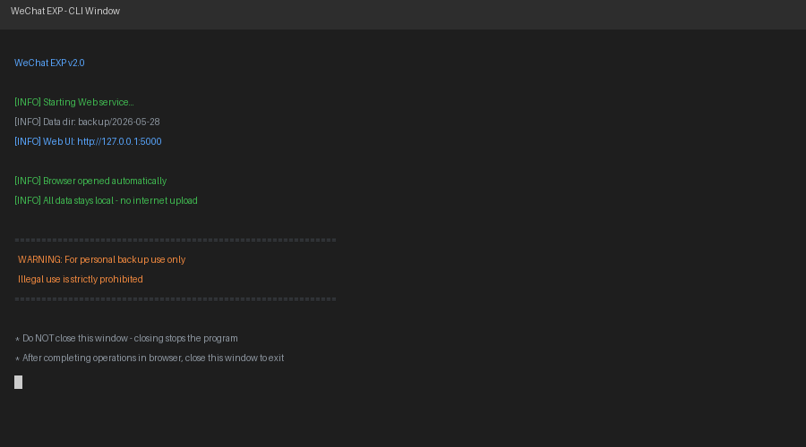
*图 15：程序运行时的命令行窗口 — 请勿关闭*

### Q3：浏览器没有自动打开

**解决方法**：
1. 手动打开浏览器（建议使用 Chrome、Edge 或 Firefox）
2. 在地址栏输入 `http://127.0.0.1:5000`
3. 按回车键访问

### Q4：网页打开了但显示"无法连接到后端"

**可能原因**：端口被占用

**解决方法**：
1. 确认命令行窗口没有关闭
2. 检查 5000 端口是否被其他程序占用
3. 如果是高级用户，可通过命令行指定其他端口（见附录）

### Q5：备份时提示"未找到微信数据目录"

**原因**：微信未安装或从未在此电脑上登录。

**解决方法**：
1. 确认微信已安装
2. 确认至少登录过一次微信（登录后微信会创建数据目录）
3. 重新运行程序

### Q6：备份时提示"密钥不足"

**原因**：部分数据库的密钥未在已保存的配置中，且自动提取未成功。

**深层原因**：微信只在登录后一小段时间内将所有数据库的密钥加载到内存中。时间久了，老数据库（很久没聊过的联系人或群聊）的密钥可能已被微信从内存中清除，此时无论自动还是手动提取都无法获取到。

**说明**：程序在备份解密阶段会自动检测缺失的密钥，并从微信进程内存中自动提取重试。只有在自动提取也失败时，才会提示此错误。

**解决方法（按推荐顺序）**：
1. ⭐ **最可靠**：**退出微信 → 重新登录 → 立即运行「一键备份」**。刚登录时所有 DB 密钥都在内存中，提取成功率最高。
2. 确保微信正在运行且已登录（支持 WeChat.exe 和 Weixin.exe）
3. 点击仪表盘「工具」模块中的「**提取密钥**」按钮手动提取
4. 等待提取完成后，重新点击「一键备份」

### Q7：图片显示"V2加密图片，暂不支持解码"

详见[第 5 章](#5-v2-图片显示问题)的完整说明。

### Q8：页面显示空白或点击按钮没反应

**解决方法**：
1. 按 `Ctrl+F5` 强制刷新页面
2. 尝试更换浏览器（建议使用 Chrome 或 Edge）
3. 关闭并重新运行 `wechat_exp.exe`

### Q9：如何备份多个微信账号

程序会自动检测第一个微信账号。如需切换账号：
1. 在微信中登录目标账号
2. 重新运行程序
3. 点击「一键备份」

### Q10：备份的文件存在哪里

所有备份文件保存在 `wechat_exp.exe` 所在目录下的 `backup\` 文件夹中。每次备份会创建一个以日期命名的子文件夹（如 `backup\2026-05-28\`）。

### Q11：备份会占用多少空间

与微信数据目录的大小相近。通常首次备份需要 2-10 GB。后续增量备份（只备份新增数据）占用空间较小。

### Q12：程序会联网上传我的数据吗

**不会。** 本程序完全在本地运行，不会将您的任何聊天数据、个人信息上传到互联网。所有数据保留在您的电脑上。

---

## 7. 附录：命令行参考（高级用户）

以下内容适用于熟悉命令行的**高级用户**。普通用户无需了解此部分，直接双击 exe 使用即可。

### 7.1 全局选项

```bash
wechat_exp.exe --help           # 显示所有命令
wechat_exp.exe <命令> --help    # 显示特定命令的帮助

# 快速测试模式（无需子命令）
wechat_exp.exe -q               # 快速打开聊天查看器
wechat_exp.exe -q -c 联系人     # 快速打开指定聊天
```

| 选项 | 简写 | 说明 |
|------|------|------|
| `--quick` | `-q` | 快速测试：跳过备份，直接打开聊天查看器（使用已有备份数据） |
| `--contact` | `-c` | 配合 `--quick`，自动打开指定联系人的聊天（支持名称模糊匹配） |

### 7.2 backup 命令

```
wechat_exp.exe backup [选项]

选项：
  --db-dir PATH         微信 db_storage 目录路径
  --output, -o PATH     备份输出目录
  --key-file PATH       密钥文件路径（可选，默认自动检测）
  --days N              备份最近 N 天 (默认: 30, 0=全部)
  --date-from DATE      起始日期 YYYY-MM-DD
  --date-to DATE        截止日期 YYYY-MM-DD
```

### 7.3 serve 命令

```
wechat_exp.exe serve [选项]

选项：
  --decrypted-dir PATH  备份数据目录（如已备份则自动检测）
  --host HOST           监听地址 (默认: 127.0.0.1)
  --port PORT           监听端口 (默认: 5000)
```

### 7.4 export 命令

```
wechat_exp.exe export -m <模式> [选项]

模式：chat / wordcloud / report / employee / list / keys / decrypt

选项：
  --chat NAME           指定聊天对象 (wordcloud 模式)
  --output, -o PATH     输出路径
  --excel PATH          员工 Excel 文件路径 (employee 模式)
  --decrypted-dir PATH  备份数据目录
```

### 7.5 harvest-keys 命令

```
wechat_exp.exe harvest-keys [选项]

选项：
  --decrypted-dir PATH  备份数据目录
  --wxid WXID           微信用户 ID (自动检测)
  --interval SECONDS    扫描间隔秒数 (默认: 2.0)
  --max-rounds N        最大扫描轮次 (默认: 无限)
```

### 7.6 典型工作流（命令行）

```bash
# 首次使用：备份 → 收割密钥 → 启动查看
wechat_exp.exe backup --days 30
wechat_exp.exe harvest-keys
wechat_exp.exe serve

# 日常快速查看（跳过备份，直接用已有数据）
wechat_exp.exe -q                  # 打开聊天查看器
wechat_exp.exe -q -c 张三          # 直接打开张三的聊天

# 仅更新最近一周数据
wechat_exp.exe backup --days 7 --output "backup\latest"
wechat_exp.exe serve --decrypted-dir "backup\latest"

# 导出分析报告
wechat_exp.exe export -m wordcloud
wechat_exp.exe export -m report
```

### 7.7 从源码运行（开发者）

如果您下载的是源代码版本（而非打包好的 .exe），需要先安装 Python 依赖：

```bash
pip install -r requirements.txt
python main.py backup
python main.py serve
```

源代码版本的使用方式与 .exe 版本完全一致，只需将命令中的 `wechat_exp.exe` 替换为 `python main.py`。

---

> **技术支持**：如遇到问题，请查看 `docs/开发手册.md` 了解技术细节，或提交 Issue 反馈。  
> **最后更新**：2026-05-31

---

## 下载地址

- 最新版本：`wechat_exp.exe` → [点击下载](https://github.com/sunhanaix/pc_wechat_exp/releases/download/untagged-be247e6259ffddcbf085/wechat_exp.exe)

**源码地址**：[https://github.com/sunhanaix/pc_wechat_exp](https://github.com/sunhanaix/pc_wechat_exp)

> 反馈问题时请提供：  
> 1. 程序运行的完整截图或文字输出  
> 2. 微信版本号（设置 → 关于微信）  
> 3. 操作系统版本（Win+R → `winver`）
